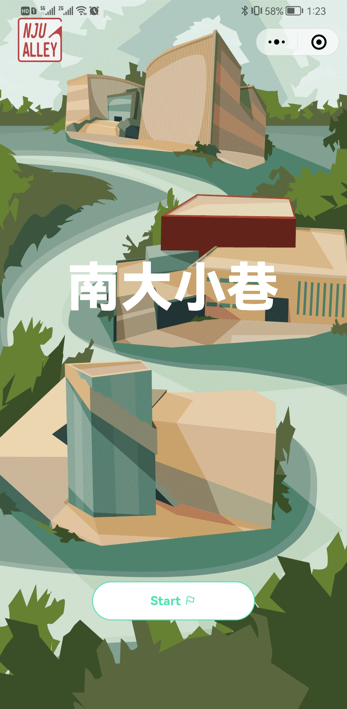

# 🌟🌟🌟南大小巷：南京大学公共空间的“大众点评”

# 🌟给自己加一个星星



体验地址：


前端开发：

xq,xzx,czh

后端开发：

hwd,zzh

后端项目地址：[xxh160/alley-server-v2: 用于校园建筑评分的 nju-alley 后端 (github.com)](https://github.com/xxh160/alley-server-v2)

🌟项目用途：南京大学公共空间的建筑评分与讨论


:tanabata_tree:以下是我一个月以来的一些尝试的过程

1. 腾讯移动分析服务

   腾讯因为收益太少于2020年9月25日给它下架了。没用成。

2. 企业认证

   具有评论功能的小程序被微信官方认为是社交类的，所以需要注册企业版小程序。

   因此必须进行企业认证。

   有如下几个途径：

   - 自己注册公司：在南京地区注册一家公司大约要600元，自己办理手续繁琐。请人待办大约需要3-5个工作日。
   - 挂靠在他人的企业

3. 关闭云开发

   刚开始注册小程序的时候似乎默认进行云开发。

   云开发的好处是不用后端服务器。

   坏处是只能处理一些简单的函数，并且关闭它的设置十分难找。

4. 使用weapp组件，vant-ui

   有两种使用方式：

   1. 构建npm包：对熟悉npm操作的人比较友好
   2. 下载源码进行引用：简单粗暴

5. 学习flex布局

   没看完

6. 完成逻辑跳转和基本功能

   页面构成

   ```
    "pages/white/white",
       "pages/index/index",
       "pages/conversation/conversation",
    "pages/notifications/notifications",
       "pages/user/user",
    "pages/review/review",
       "pages/building/building",
    "pages/map/map",
       "pages/welcome/welcome",
    "pages/introduce/introduce",
       "pages/logs/logs"
```
   
基本功能：
   
- 引导页
   
  设置一个白页，或者加载动画
   
  在这个页面的js文件里面将整个小程序的页面跳转方式记下来
   
- 浏览地图
   
  选用合适的地图API
   
     需要满足条件：显示3D建筑
   
  微信小程序自带map组件
   
  只要使用
   
  ``` wxml
     <map id="map" longitude="113.324520" latitude="23.099994" scale="14"></map>
     ```
   
     微信小程序中的map组件默认使用腾讯地图。
   
     设置map全屏：
   
     ``` js
     //index.js
     var app = getApp()
     Page({
         data: {
             height: 'auto'
         },
         onLoad: function () {
             //保证wx.getSystemInfo的回调函数中能够使用this
             var that = this
      
             //调用wx.getSystemInfo接口，然后动态绑定组件高度
             wx.getSystemInfo({
                 success: function (res) {
                     that.setData({
                         height: res.windowHeight
                  })
                 }
          })
      
      }
     })
  ```
   
  - 腾讯地图微信小程序组件
   
    因为腾讯地图在微信开发者工具中的3D楼块显示效果不好，所以开始考虑其它方案。
   
  - 百度地图微信小程序组件
   
    百度地图似乎都没有3D建筑的功能
   
     - 高德地图微信小程序组件
   
       高德也没有
   
  - 使用ESMAP制作h5，在小程序中进行web-view跳转
   
    > web-view是承载网页的容器
       >
    > 会自动铺满整个小程序页面
       >
    > 个人类型的小程序暂不支持使用
   
    ESMAP不是完全免费，并且给小程序的api十分有限
   
    3D楼块的展示也不是很好看
   
     - 使用百度地图的JavaScript API
   
       JavaScript API无法直接用到小程序中，必须同ESMAP一样，首先建立一个h5页面，然后通过小程序的web-view进行交互。
   
       发现了web-view的一系列问题：
   
       1. 打开的域名没有在小程序管理后台设置业务域名（注意是业务域名，不是服务器域名） 
    2. 打开的页面必须为https服务
       3. 打开的页面302过去的地址也必须设置过业务域名
    4. web-view空白问题，请升级微信客户端到 6.5.16
       5. 页面可以包含iframe，但是iframe的地址必须为业务域名
    6. web-view不支持支付能力，web-view的API能力见web-view的文档说明
       7. 开发者自己检查自己的https服务是否正常，测试方法：普通浏览器打开对应的地址
    8. 如果web-view使用了公众号授权的服务，开发者工具提示网页开发者的问题，请见：公众号开发
   
    这玩意就跟微信小程序禁用svg一样，把本来简单的问题极端复杂化了。
   
    然而，就当没有办法的时候。
   
    突然发现腾讯地图的微信小程序组件中的3D模块在真机演示时候的效果惊人。
   
    于是满意地继续下去。
   
       - 头像悬浮
   
    - 修改微信原生标题栏
   
         变成全面屏 
   
         ``` json
         "navigationStyle": "custom"
         ```
   
     
     
     
     8. 使用小程序内置的canvas渲染器，在cax中实现svg标准的子集
     
        实现起来太过于复杂，并且这种svg仅仅只是静态图片，没有办法有动态效果
- 确定使用条款与权限
  
  我们重视用户的隐私。您在使用我们的服务时，我们可能会收集和使用您的相关信息。
  
  您的用户信息将会用于小程序自身的完善。我们保证不会将其用于第二用途。
  
  谢谢您的理解。
  
     - rpx
     
       ### rpx （ responsive pixel）响应单位
     
       - rpx是微信小程序独有的、解决屏幕自适应的尺寸单位
       - 可以根据屏幕宽度进行自适应，不论大小屏幕，**规定屏幕宽为750rpx**
       - 通过 rpx 设置元素和字体的大小，小程序在**不同尺寸**的屏幕下，**可以实现自动适配**
  
  - 解决一下体验版的问题
  
    好像是微信的问题，永远都无法成功调用getApp()
  
  - 添加点聚合
  
    1. 地图上的 marker 分为普通的 marker 与参与聚合的 marker，参与聚合时需指定属性 joinCluster 为 true；
    2. 自定义聚合簇样式时，同样通过 [MapContext.addMarkers](https://developers.weixin.qq.com/miniprogram/dev/api/media/map/MapContext.addMarkers.html) 进行绘制，此时需携带 clusterId
  
    真机调试的时候无法访问localhost后台：
  
    解决方案：
  
    将手机和电脑置于同一个局域网中，将localhost改为ip
  
    有一个非常坑人的地方在于
  
    点聚合的时候编译器上面怎么也不显示，只有真机调试的时候才行
  
  - 替换图标
  
    调整长宽比为2：1
    
  - 完成建筑的接口
  
    需要上传照片
  
    上传完成
  
  - 完成点评的接口
  
    ```javascript
    wx.navigateBack({
      delta: 2
    })
    ```
  
     返回页面栈中的页面
  
  - 完成讨论区的样式修改
  
  - 阿里云oss获取协议接口
  
    wx.uploadfile
  
    上传图片返回url
  
    status201
  
    富文本格式解析
  
    图片链接是自己决定的
  
    查看阿里云oss文档
  
    - 调整讨论区样式
  


还需要完成的工作：

1. 小程序命名

   需要等域名审核结果出来

   2. 中英文

      因为涉及内容，所以最后做

   3. 字体问题

      影响不大，可以放在最后
      
   4. 致谢

      为了完成这个小程序拜托了太多的人。

      有太多需要感谢的朋友了。

      其实只是当时的灵机一动。

      偶然得知清扬的社会实践做的是公共空间相关，侯为栋的小程序是一个地图社交平台。
      
      选修的文化研究的课程需要做公共空间相关的课题。
      
      想起自己大学两年在仙林的时光很快就要结束了，可是连一丝丝痕迹都没有留下。
      
      感谢刻师傅牛杂团队的几位提供了想法原型。
      
      感谢张清扬愿意提供一个这样合作的机会。
      
      感谢吴维忆老师愿意接受邀请担任社会实践的指导老师。
      
      感谢张长悦学姐和她的学弟男朋友愿意用我的提议做课堂展示，还给我提供了一个打广告的机会。
      
      感谢侯为栋一直任劳任怨地写后端，从开始到最后。
      
      感谢郑子涵默默无闻地码代码。
      
      感谢爸妈给我提供了公司企业资质证明，要不然我得自己开一家公司。
      
      感谢熊智星写了许多前端样式，话不多但是效率非常可以。
      
      感谢徐琪写了许多接口，以及回答我各种奇怪问题。
      
      感谢重庆的徐朝越，查丽萍，余波，邹国庆，我在异乡的时候给了很多的照顾。
      
      感谢鸿鹄志实践团队负责宣传的各位（我还不知道是谁
      
      最后，感谢在我奔波流离，跌宕起伏时一直陪伴在我身边鼓励我的宝贝芝坤。
      
   
2. 修改个人信息

3. 静默登录


1. 获取用户发表的所有评论

   放在地图页面

